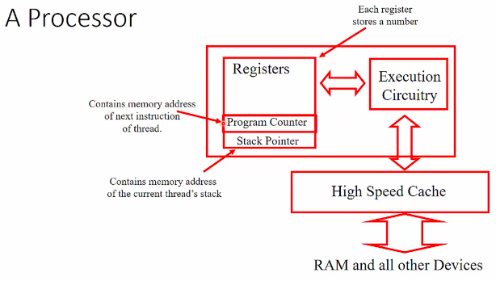
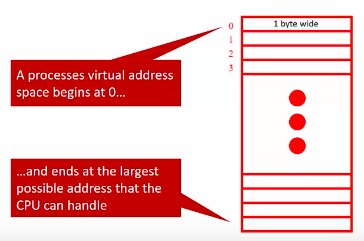

# From Programs to Execution

[**Youtube**](https://www.youtube.com/watch?time_continue=3&v=Vwe_EDCWAzU)

## The Underlying Hardware
* The OS provides software access to the hardware in an *abstracted* manner
* What does that hardware actually look like? I always looks different.

## Intel X99 Chipset Block Diagram

## A Processor

## Memory
* Memory is an array of *bytes*
* Temporary storage only:
  * Much slower than the processor and cache
  * Much faster than a disk

## Other Storage Devices
* Persistent storage
    * Magnetic Hard Disk Drives (HDD)
    * Non-volatile memory
        * Solid State Drives (SSD)
        * Flash memory
    * Magnetic tapes
    * Optical (CD-ROM, DVDs, BD, etc.)

* All slower than RAM, but keep their memory without power

## Virtual Memory
* Virtual memory hardware creates the illusions of:
  * Un-shared, exclusive memory
  * Unlimited memory (up to the max address size)   

## Running a Program

## Typical Organization of Program in Memory

## Stack Versus Heap

* **The Stack**
  * Stores local automatic variables and function return pointers as the program enters and exits scoped blocks of code
  * Memory managed efficiently by CPU
  * Variable size is limited by OS settings
  * Variables cannot be resized

* **The Heap**
  * Variable are allocated manually (malloc(), calloc())
  * Memory is unmanaged, so fragmentation can occur; heap access is slower than stask
  * Variable size is limited (other than virtual memory limits)
  * Variables can be resized with realloc()

