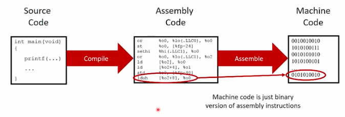

# From Programs to Execution

[**Youtube**](https://www.youtube.com/watch?time_continue=3&v=Vwe_EDCWAzU)

## The Underlying Hardware
* The OS provides software access to the hardware in an *abstracted* manner
* What does that hardware actually look like? I always looks different.

## Intel X99 Chipset Block Diagram


## A Processor


## Memory
* Memory is an array of *bytes*
* Temporary storage only:
  * Much slower than the processor and cache
  * Much faster than a disk


## Other Storage Devices
* Persistent storage
    * Magnetic Hard Disk Drives (HDD)
    * Non-volatile memory
        * Solid State Drives (SSD)
        * Flash memory
    * Magnetic tapes
    * Optical (CD-ROM, DVDs, BD, etc.)

* All slower than RAM, but keep their memory without power

## Virtual Memory
* Virtual memory hardware creates the illusions of:
  * Un-shared, exclusive memory
  * Unlimited memory (up to the max address size)  
 


## Running a Program


## Typical Organization of Program in Memory


## Stack Versus Heap

* **The Stack**
  * Stores local automatic variables and function return pointers as the program enters and exits scoped blocks of code
  * Memory managed efficiently by CPU
  * Variable size is limited by OS settings
  * Variables cannot be resized

* **The Heap**
  * Variable are allocated manually (malloc(), calloc())
  * Memory is unmanaged, so fragmentation can occur; heap access is slower than stask
  * Variable size is limited (other than virtual memory limits)
  * Variables can be resized with realloc()

## Creating The Program Code
* How do we turn a high-level program (C++, Java) into something that the computer can run?

## Creating The Program Code - High Level
* By default, most compilers will compile, link, and assembly your source code, though you can split those steps up for more control.  



## The compile/link process
1) The C pre-processor expands macros and strips out comments
  * #include, #define, #ifdef, //, /\*, \*/, etc.
2) The compiler parses your source, checks for errors and generates assembly language code
3) The compiler calls the assembler, which converts assembly code to machine binary code
4) If you are compiling an executable, the linker step tries to match function calls to function code (they might be in different files!)

## GCC - the standard UNIX compiler
* Basic compilation options
  * -g		Compile with debugging info for GDB
  * -c 		Complies only, without linking (more later)
  * -S		Generates assembly code
  * -O3		Optimizes as much as possible
  * -o 		Specifies the *name* of the output file
  * -Wall	Turns on all warnings
  * -l*library* Adds support or library *library* when linking (for example, -l*pthread*)
* These should work with any of the UNIX CLI C/C++ compilers

## Compiling an Executable
* If you have *one* source (.c) file:
  * $ gcc -o dbtest dbtest.c (use unique names to avoid using system programs)
* If you have *multiple* source (.c) files:
  * Option A (*simpler*): compile them all at once, together into one excutable:
  * $ gcc -o dbtest dbtest.c dbcreate.c dbopen.c

## Separate Compile and Link
* If you have *multiple* source (.c) files:
  * Option B (*more efficient*): compile them one at a time without linking, then link them all toegether at the end

1) First compile all source files separately into object files (.o):
``` 
$ gcc -c dbtest.c
$ gcc -c dbcreate.c
$ gcc -c dbopen.c
$ gcc -c dbread.c
```
2) Link all the object (.o) files together to create an executable:
` $ gcc -o dbtest dbtest.o dbcreate.o dbopen.o `

## Compile & Link


## Library Archives
* Library archives are collections of object files (.o) gathered into a single large file, with indexes to make accessing them fast
  * Usually faster than having to read every .o file
  * Easier to link with if you aren't changing the library object files frequently
* To create a library
  * First create all the object files
  * Then use the ar command:
  * ` $ ar -r libdb.a dbcreate.o dbopen.o dbread.o`

## Using Library Archives
* Include the library anywhere you can use an object file:
  * `$ gcc -o dbtest dbtest.o libdb.a

## Hello World!
* A complete C compilation and execution example:
` $ cat hw.c `    

``` C
#include <stdio.h>

```


