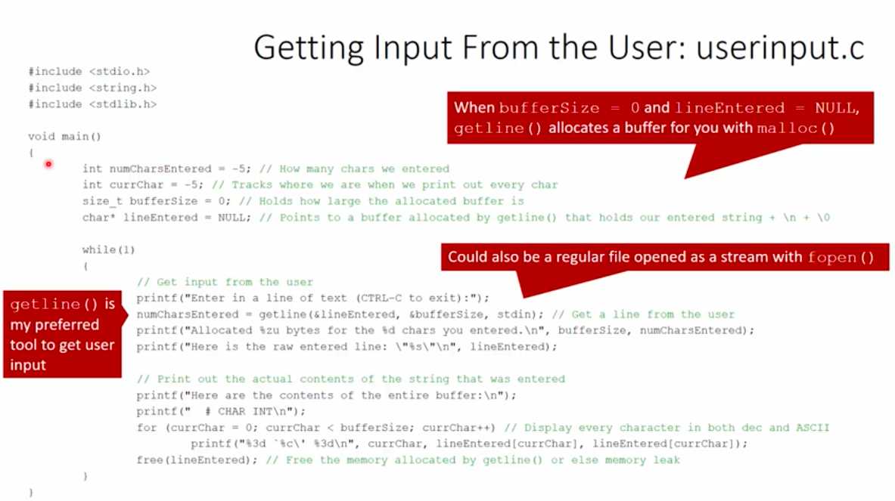
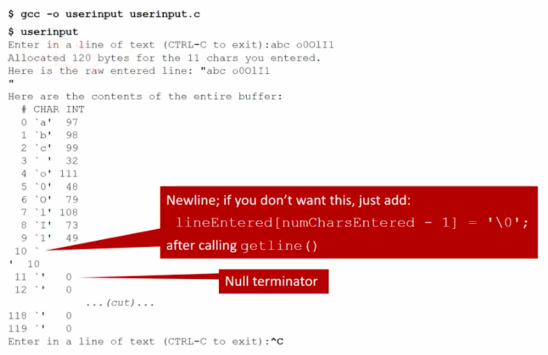

# 2.4 - File Access in C

[**Youtube**](https://www.youtube.com/watch?v=seZQ21DhJMo)

## UNIX Paradigm
* Everythin is a file!
  * Except processes

* Directory contents could include:
  * Hard links
  * Symbolic links
  * Named pipes
  * Device character special file
  * Device block special file
  * Named socket

## What is a File in UNIX?
* System programmer view:
    * A strem of bytes
        * Could be accessed as an array  
        * Newlines/carriage returns & tabs are all just bytes, too!
    * Persistent
* How do we access files for reading and writing

## Opening a File
* Files can be open for:
  * read only :: O\_RDONLY
  * write only :: O\_WRONLY
  * read and write :: O_RDWR
* When you open a file for writing...
  * Should you delete an existing file with the same name?
  * If not, where do you want to start writing? Beginning? End? Somewhere else?
  * If the file doesn't exist, should you create it?
  * If you create it, what should the initial access permissions be?

## The File Pointer
* Tracks where the next file operation occurs in an open file
* Separate file pointer is maintained for each open file
* All of the operations we're talking about:
  * Directly impact which byte in a file is pointed to by the file pointer when the file is opened
  * Move the file pointer

## Open for Read

## Open for Write

## Truncating an Existing File
* When you open a file for writing, should you delete all contents of an existing file with the same name, or write over existing contents?
  * To delete it and start fresh: O\_TRUNC

* Example:
  * `file_descriptor = open(file, O_WRONLY | O_TRUNC);`
  * Opens an existing file for writing only, then deletes all the data in it 
  * Sets the file pointer to position 0

## Appending to an Existing File 
* Open the file in append mode with flag: O\_APPEND
* Before *every* write, the file pointer will be automatically set to the end of the file
* Example
  * `file_descriptor = open(filepath, O_WRONLY | O_APPEND);`
  * Open san existing file for writing only in append mode

## O_APPEND and the File Pointer
 

## Creating a New File
* To open (or create) a file that doesn't exist, use flag: `O_CREAT`
* Example: open a file for writing only, creating it if it doesn't exist:
* `file_descriptor = open(filepath, O_WRONLY | O_CREAT, 0600);`
* The third parameter of open() *must* be used when the creation of a new file is requested (i.e. using `O_CREAT` or `O_TMPFILE`) 
  * Even though the open() call will probably fail in bizarre ways if you don't include the third argument here, it still compiles! Thanks, C

## Creating A New File - Acces Permissions
* Again, the third parameter of open() *must* be used when the creation of a new fiel is requested (i.e. using `O_CREAT` or `O_TMPFILE`)
* Third paramter contains octal number permissions bits:
  * Specify directly as with chmod: 0600
  * Or you can bit-wise OR flags together: `S_IRUSR` | `S_IWUSR`
* Example:
  * `file_descriptor = open(file, O_WRONLY | O_CREAT, 0600);`
  * `file_descriptor = open(file, O_WRONLY | O_CREAT, S_IRUSR | S_IWUSR);`

## lseek()
* Manipulates a file pointer in a file
* Used to control where you're messing with da biz
* Examples:
  * Move to byte #16 - `newpos = lseek(file_descriptor, 16, SEEK_SET)`;
  * Move forward 4 bytes - `newpos = lseek(file_descriptor, 4, SEEK_CUR)`;
  * Move to 8 bytes from the end - `newpos = lseek(file_descriptor, -8, SEEK_END)`;

## lseek() :: SEEK_SET :: Setting Postion

## lseek() :: SEEK_CUR :: Moving Backwards

## lseek() :: SEEK_CUR :: Moving Forwards

## lseek() :: SEEK_END :: Moving Forwards

## Read/Write and the File Pointer
* If you've opened a file for reading and/or writing, be aware that *both* of these operations will change the file pointer location!
* The pointer will be incremented by exactly the number of bytes read or written

## read() and the File pointer

## write() and the File Pointer

## Complete Read/Write Example

## The Standard IO Library in C
* `fopen, fclose, printf, fprintf, sprintf, scanf, fscanf, getc, putc, gets, fgets, fseek, etc.`
* Automatically buffers input and output intelligently 
* Easy to work in line mode
  * i.e, read one line at a time
  * write one line at a time
* Powerful string and number formatting
* To use them:
  * `#include <stdio.h>`

## Why Teach and Use read() & write()?
* Maximum performance
  * If you know exactly what you are doing
  * No additional hidden overhead from stdio, which is much slower!
  * No hidden system calls behind stdio functions which may be non-reentrant
* Control exactly what is written/read and at what times

## Some stdio Functions
* `fclose` - Close a stream
* `feof` - Check if End Of File has been reached
* `fgetc` - Get next character from a stream
* `fopen` - Open a file
* `fprintf` - Print formatted data to a stream
* `fputc` - Write character to a stream
* `fread` - Read block of data from a stream
* `fseek` - Reposition stream's position indicator (stdio version of lseek)
* `getc` - Get the next character
* `getchar` - Get the next character from stdin

## Files or Streams?
* **stdin**, **stdout**, and **stderr** are actually *file streams*, not file system files
* File streams wrap around, and provide buffering to, the underlying file descriptor among other features
* The stdio library streams are connected with the fopen() call to a variable of type `FILE*`:
  * `FILE* myFile = fopen("datafile103", "r");`
* Streams are closed when a process terminates
* Raw file descriptors with open files are passed on to child processes:
  * A process spawns a new child process with `fork()`, all open files are shared between parent and child processes

## General Input From the User: userinput.c

## Results - Getting Input From the User: userinput.c

## Obtained File Information
* `stat()` and `fstat()`
* Retrieve all sorts of information about a file or directory
  * Which device it is stored on
  * Ownership/permissions of that file
  * Number of hard links pointing to it
  * Size of the file
  * Timestamps of last modification and access
  * Ideal block size for I/O to this file

