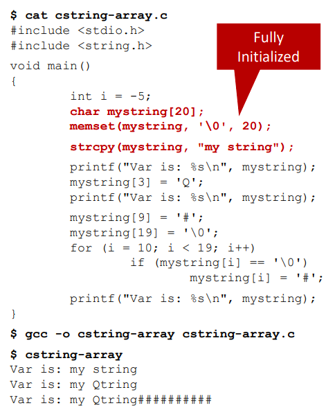
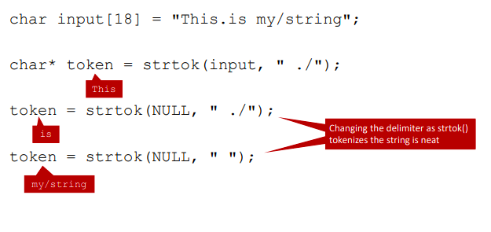
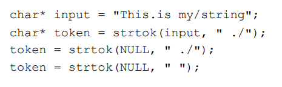
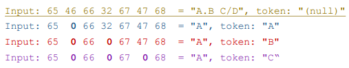

# Strings in C: A Programmer's Nightmare

[**Youtube**](https://www.youtube.com/watch?v=71cUrhPYMes)

## C Strings 
* Strings in C are sequences of characters contiguously stored
  * Not native type like `int` or `float` in more advanced languages
* A "string" terminates with the null character `\0`
* That's *it*! Any further programmatic use of strings requires functions and procedures that work within this format

## Displaying C String with Formatted Printing
* Formatted means numbers correctly printed with text
* Formatted printing is done with:
  * `printf()` - Prints to standard out
  * `sprintf()` - Prints to a string (a char array)
  * `fprintf()` - Prints to a file
* These functions look for null terminators to know when to stop

## Basic C String Functions
* Use the strings library functions:
  * `strcmp()` - Compares two stings for equality
  * `strlen()` - Returns the length of the string in characters, not including null terminator
  * `strcpy()` - Copies one string into another
  * `strcat()` - Returns one string that is a concatenation of itself with another string
* n-character versions:
  * `strncpy()` _ Copy only n characters - won't null-terminate a full array, or actually prevent you from over-writing an array
  * `strncat()` - Appends only a portion of a string to another

## Declaring C Strings
* Three ways of declaring the same string
  1) `char* mystring = "mystring";`
  2) `char mystring[] = "mystring";`
  3) `char mystring[20] = "mystring";`
* Are they really the same? And why do we care in OS?
* Because this one difference shows how close C is to the underlying memory management being performed by UNIX
* i.e. you need to know this, because otherwise you'll break all the things and not know why

## Declaring Strings – Method 1
* `char* mystring = "mystring";`
* At compile time, create a sequence of bytes in the **read-only initialized data segment** portion of memory with the contents "my string"
* During execution, create a pointer on the **stack** (automatic variable) called `mystring` that points to the read-only sequence of characters in the **data segment**
* `mystring` can be pointed to other addresses (it doesn't hold chars by itself, as it's a pointer)

## Declaring C Strings – Method 1 – Example
``` C
#include <stdio.h>

void main() 
{
	char* mystring = "my string";
	printf("Var is: %s\n", mystring);
	mystring[3] = 'Q';
	printf("Var is: %s\n", mystring);
}
```
* Result:
```
Var is: my string
Segmentation fault (core dumped)
```

## Declaring C Strings – Method 2
* `char mystring[] = "mystring";`
* During execution, creates space for 10 bytes on the **stack** as an automatic variable, names that variable *mystring*
* Puts **"my string"** into the variable *mystring* with a null terminator after it
* The varialble *mystring* is editable, as it is an array

## Declaring C Strings – Method 2 – Example
``` C
#include <stdio.h>

void main() 
{
	char mystring[] = "mystring";
	printf("Var is: %s\n", mystring);
        mystring[3] = 'Q';
        printf("Var is: %s\n", mystring);	
}
```
* Result:
```
Var is: my string
Var is: my Qtring
```

## Declaring C Strings – Method 3
* `char mystring[20] = "mystring"; `
* Creates space for 20 bytes on the **stack** as an automatic variable, names the variable `mystring`
* Puts **"my string"** into the variable *mystring* with a null terminator after it
* The variable `mystring` is editable, as it is an array

## String Literals (Again)
* What's wrong with this code
``` C
char* mystring = "my string";
strcpy(mystring, "AA string";
printf(mystring);
```
* String literals cannot be changed in C - they are initialized in the **read-only** section of the **initialized data segment**
* When is this error caught?
  * Only at run-time, as a seg-fault; this compiles fine

## Buffer Overrun
* What's wrong with this?
``` C
char fiveStr[5] = "five";
strcpy(fiveStr, "five6";
printf(fiveStr);
```

* "five6" is too long to store in `fiveStr`
* When is this error caught?
  * Never! 
  * Unless something you needed is overwritten and a segfault occurs because a just-accessed pointer no longer points to where it was supposed to!

## Fully Initializing C String Arrays
``` C
char mystring[20];
strcpy(mystring, "my string");
printf("%s", mystring);
```
* Result:
```
my string
```

## What's In That Uninitialized Data?
* `$ cat csting-array-unint.c`
``` C
#include <stdio.h>
#include <string.h>

void main() 
{
	int i = -5;
	char mystring[20];

	strcpy(mystring, "my string");
	printf("Char => Int :: ASCII Table Lookup\n");

	for (i = 0; i < 19; i++) 
		printf("%c => %d\n", mystring[i], mystring[i]);
}
```
* `$ gcc -o cstring-array-unint cstring-array-unint.c`
* `$ cstring-array-unint`
```
Char => Int :: ASCII Table Lookup
m => 109
y => 121
=> 32
s => 115
t => 116
r => 114
i => 105
n => 110
g => 103
=> 0
@ => 64
=> 0
=> 0
=> 0
=> 0
=> 0
@ => 64
W => 87
▒ => -26i
```

## Initializing C String Arrays - The Bad
* Depending on how you declare them, C string arrays may be full of uninitialized data - it's best to clear them before use
* What happens if we somehow remove the automatic null terminator?

* `$ gcc -o cstring-array cstring-array.c`
* `$ cstring-array`
```
Var is: my string
Var is: my Qtring
Var is: my Qtring#@#####▒t▒"
```


## Meanwhile Back on the Ranch...
* C continues to provide dangerous string functions
* `strtok()` :: string tokenizer
* splits strings into chunks
* Makes your hair fall out
* Maxes out your credit cards
* Unfriends all your social media friends
* Sometimes the best/only tool for the job :/

## strtok Example


## A Major strtok() Drawback *(the first of many)*

* Failes miserably, crashin on execution: Why?
  * Because `input` is a string literal, and `strtok()` is about to mess with your strings

``` C
#include <stdio.h>
#include <string.h>
void main()
{
	char input[50];
	char* token = 0; // Set null pointer
	int inputsize = -5;
	int currChar = -5;
	memset(input, '\0', 50);
	strcpy(input, "A.B C/D");
	inputsize = strlen(input);
	printf("Input: "); for (currChar = 0; currChar < inputsize; currChar++) printf("%2d ", input[currChar]);
	printf(" = \"%s\", token: \"%s\"\n", input, token);
	token = strtok(input, " ./");
	printf("Input: "); for (currChar = 0; currChar < inputsize; currChar++) printf("%2d ", input[currChar]);
	printf(" = \"%s\", token: \"%s\"\n", input, token);
	token = strtok(NULL, " ./");
	printf("Input: "); for (currChar = 0; currChar < inputsize; currChar++) printf("%2d ", input[currChar]);
	printf(" = \"%s\", token: \"%s\"\n", input, token);
	token = strtok(NULL, " ./");
	printf("Input: "); for (currChar = 0; currChar < inputsize; currChar++) printf("%2d ", input[currChar]);
	printf(" = \"%s\", token: \"%s\"\n", input, token);
}
```

## strtok Example Results

* `input` gets jacked up by `strtok()` as the delimiters encountered during parsing get nulled
* Further, this can only work because `strtok()` keeps a hidden static variable in the data segment up to date while parsing`

## Further strtok Horros
* Not only does `strtok()` modify the input..
  * (you don't even specify which string to tokenize past the first call! Hidden vars!)
``` C
char input[18] = "This.is my/string";
char* token = strtok(input, " ./");
token = strtok(NULL, " ./");
token = strtok(NULL, " ");
```
* Mixing calls of `strtok()` between different strings is not allowd because it can only process ONE string with its hidden variables!
  * But there is a `strtok_r()` that achieves re-entrancy, allowing the mixing of calls, by requiring you pass in a pointer to a temp variable for it to use

## Horros Explained
* This mixing of `strtok()` calls is easy to do on accident in a large program, especially with functions involved:
``` C
strtok(input1, …)
function()
	strtok(input2, …)
strtok(input1, …)
```
* The solution is to simply use a more modern language with a string type

## Combining Declaration Methods
* What does this mean:
  * `char* mystring[3];`


