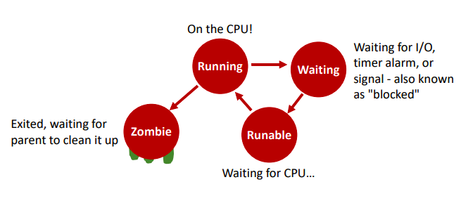
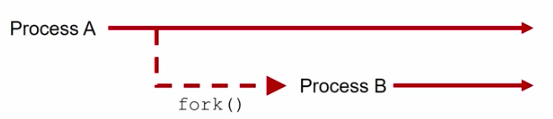
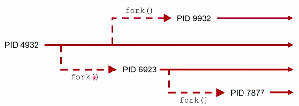
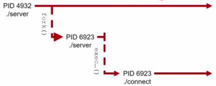

# Lecture 3.1 - Processes

[**Youtube**](https://www.youtube.com/watch?v=1R9h-H2UnLs)

## The Process 
* Process Management is a necessary component of a multiprogrammable operating system
* Process:
  * An instance of an executing program, with a collection of execution resources associated with it

## UNIX Process Components
* A unique identity (process id aka pid) :: `pid_t pid = getpid();`
* A virtual address space (from 0 to memory limit)
* Program code and data (variables) in memory
* User/group identity (controls what you can access), unmask value
* An execution environment all to itself 
  * Environment variables 
  * Current workig directory
  * List of open files
  * A description of actions to take on receiving signals
* Resource limits, scheduling priority
* and more... see the exec() man page

## Programs vs Processes
* A **program** is the executable code
* A **process** is a running instance of a program
* More than one process can be concurrently executing the same program code, with separate process resources

## Important Process States in UNIX


## How Do You Create a Process?
* Let the shell do it for you!
  * When you execute a program, the shell creates the process for you
* In some cases, you'll want to do it yourself
  * Our shell-writing assignment
* Unix provides a C API for creating and managing processes explicitly, as the following material shows


## Managing Processes
* Functions we'll be covering:
    * fork()
    * The exec() family
        * execl(), execlp(), execv(), execvp()
    * exit()
    * wait(), waitpid()
    * getpid()
    * getenv(), putenv()

## How to Start a New Process

* Process A and B are nearly identical copies, both running the same code, and continuing on from where the fork() call occured.

## Process A == Process B??
* The two processes have different pids
* Each process return a different value from fork()
* Process B gets copies of all the open file descriptors of Process A
* Process B has all the same variables set to the same value as Process A, but they are now separately managed!

## fork()
* A sample program using fork()
```c
#include <sys/types.h>
#include <unistd.h>
#include <stdio.h>
#include <stdlib.h>

void main()
{
	pid_t spawnpid = -5;
	int ten = 10;

	spawnpid = fork();
	switch (spawnpid)
	{
		// If something went wrong, fork() returns -1 to the
		// parent process and sets the global variable errno;
		// no child process was created
		case -1:
			perror("Hull Breach!");
			exit(1);
			break;
		// In the child process, fork() returns 0	
		case 0:
			ten = ten + 1;
			printf("I am the child! ten = %d\n", ten);
			break;
		// In the parent process, fork() returns the process
		// id of the child process that was just created
		default:
			ten = ten - 1;
			printf("I am the parent! ten = %d\n", ten);
			break;
	}
	printf("This will be executed by both of us!\n");
}
```

## Results
```
➜ ./forktest
I am the parent! ten = 9
This will be executed by both of us!
I am the child! ten = 11
This will be executed by both of us!
```

## Key Items Inherited
* Inherited by the child form the parent:
  * Program code
  * Process credentials (real/effective/saved UIDs and GIDs)
  * Virtual memory contents, including stack and heap
  * Open file descriptors
  * Close-on-exec flags
  * Signal handling settings
  * process group ID
  * current working directory (CWD)
  * controlling terminal
  * ...

## Key Items Unique to the Child Process
* Unique to the child:
  * Process ID
  * Parent process ID is different (it's the parent that just spawned it)
  * Own copy of file descriptors
  * Process, text, data, and other memory locks are NOT inherited
  * Pending signals initialized to the empty set
  * ...

## fork() Forms a Family Tree


## Child Process Termination
* Child process can exit for two reasons
    * It completes the execution and exits normally
        * Case 1: The child process completed what it was supposed to do and exited with a successful exit status (ie 0)
        * Case 2: The child process encountered an error condition, recognized it, and exited with a non-successful exit status (ie non-zero)
    * It was killed by a signal 
        * The child process was sent a signal that by default terminates a process, and the child process *did not catch it*
* How do parents check to see if child processes have terminated?

## Checking the Exti Status
* Both of these commands check for child process termination:
  * wait()
  * waitpid()
* For both functions, you pass in a pointer to which the OS writes an int, which identifies how the child exited
  * We examine this int with various macros to learn what happened

## wait vs waitpid
* wait() will **block** - until *any* one child process terminates; returns the process id of the terminated child
* waitpid() will **block** - until process with the *specified* process ID terminates (or has already terminated); returns the process id of the terminated child
    * If you pass it a special flag, it will check if the specified child process has terminated, then immediately return even if the specified child process hasn't terminated yet

## wait() and waitpid() Syntax

* `pid_t wait(int *childExitMethod);`
* `pid_t waitpid(pid_t pid, int *childExitMethod, int options);`
* Block this parent until any child process terminates:
    * `childPID = wait(&childExitMethod);`
* Block this parent until the specified child process terminates:
    * `childPID_actual = waitpid(childPID_intent, &childExitMethod, 0);`
* Check if any process has completed, return immediately with 0 if none have:
    * `childPID = waitpid(-1, &childExitMethod, WNOHANG);`
* Check if the process specified has completed, return immediately with 0 if it hasn't:
    * `childPID_actual = waitpid(childPID_intent, &childExitMethod, WNOHANG);`


## Proper waitpid() Placement
* **forwaittest.c**
```C
#include <sys/types.h>
#include <unistd.h>
#include <stdio.h>
#include <stdlib.h>

void main()
{
    pid_t spawnPid = -5;
    int childExitMethod = -5;

    spawnPid = fork();
    if (spawnPid == -1) 
    {
        perror("Hull Breach!\n");
        exit(1);
    }
    else if (spawnPid == 0)
    {
        printf("CHILD: PID: %d, exiting!\n", spawnPid);
        exit(0);
    }

    printf("PARENT: PID: %d, waiting...\n", spawnPid);
    waitpid(spawnPid, &childExitMethod, 0);
    printf("PARENT: Child process terminated, exiting!\n");
    exit(0);
}
```
* **Results**
```
➜  block3 git:(master) ✗ ./forkwaittest
PARENT: PID: 12826, waiting...
CHILD: PID: 0, exiting!
PARENT: Child process terminated, exiting!
```

## Checking the Exit Status - Normal Termination
* `wait(&childExitMethod)` and `waitpid(..., &childExitMethod, ...)` can identify two ways a process can terminate
* If the process **terminates normally**, then the WIFEXITED macro returns non-zero:
    * `if(WIFEXITED(childExitMethod) != 0) printf("The process exited normally\n");`
* We can get the actual exit status with the WEXITSTATUS macro:
    * `int exitstatus = WEXITSTATUS(childExitMethod);`

## Checking the Exit Status - Signal Termination
* If the process **terminates by a signal**, then the WIFSIGNALED macro returns non-zero: 
    * `if(WIFSIGNALED(childExitMethod) != 0) printf("The process was terminated by a signal\n");`
* We can get the terminating signal with the WTERMSIG macro:
    * `int termSignal = WTERMSIG(childExitMethod);`

## Checking the Exit Status - Exclusivity
* Barring the use of the non-standard WCONTINUED and WUNTRACED flags in waitpid(), only *one* of the WIFEXITED() and WIFSIGNALED() macros will be non-zero!    
* Thus, if you want to know how a child process died, you need to use both WIFEXITED and WIFSIGNALED!
* If the child process has terminated normally, do not run WTERMSIG() on it, as there is *no signal number* that killed it!
* If the child process was terminated by a signal, do not run WEXITSTATUS() on it, as it has *no exit status*(i.e., no exit() or return() function were executed)!

## Checking the Exit Status
```C
int childExitMethod;
pid_t childPID = wait(&childExitMethod);

if (childPID == -1)
{
    perror("Wait failed");
    exit(1);
}

// Non-zero evaluates to true in C
if (WIFEXITED(childExitMethod))
{
    printf("The process exited normally\n");
    int exitStatus = WEXITSTATUS(childExitMethod);
    printf("exit status was %d\n", exitStatus);
}
else
    // This statement is true, but it never hurts to examine WIFSIGNALED(), also to make sure!
    printf("Child terminated by a signal\n");
```

## How to Run a Completely Different Program
* `fork()` always makes a copy of your *current* program
* What id you want to start a process that is running a completely different program?
* For this we use the `exec...()` family

## exec...() - Execute
* `exec...()` replaces the currently running program with a *new* program that you specify
* The `exec...()` functions do not return - they destroy the currently running program
    * No line after a successful exec...() call will run
* You can specify arguments to exec...(): these become the command line arguments that show up as argc/argv in C, and as the $1, $2, etc positional parameters in a bash shell

## Two Types of Execution
* `int execl(char *path, char *arg1, ..., char *argn);`
* Executes the program specified by *path*, and gives it the command line arguments specified by strings *arg1* through *argn*

* `int execv(char *path, char *argv[]);`
* Executes the program specified by *path*, and gives it the command line arguments indicated by the pointers in *argv*

## Current Working Directory
* execl() and execv() do not examine the PATH variable - they only look in the current working directory (but see the next slide)
* If you don't specify a fully qualified path name, then your programs will not be executed, even if they are in a directory listed PATH, and execl() and execv() will return with an error 
* To move around the directory structure in C, use the following:
    * `getcwd() :: Gets the current working directory`
    * `chdir() :: Sets the current working directory`

## Exec...() and the PATH variable
* `int execl(char *path, char *arg1, ..., char *argn);`
* `int execlp(char *path, char *arg1, ..., char *argn);`

* `int execv(char *path, char *argv[]);`
* `int execvp(char *path, char *argv[]);`

* The versions ending with *p* will search your PATH environment variable for the executable given in *path*
* In general, you'll want to use the versions with *p* - execlp() or execvp() - as they are much more convenient

## Execute a New Process
* exec...() *replaces* the program it is called from - it does not create a new process!
* Using fork() and exec...() , we can keep our original program going, and spawn a brand-new process!



## Passing parameters to execlp()
* `int execlp(char *path, char *arg1, ..., char argn);`
* First parameters to execlp() is the pathname of the new program
* Remaining parameters are "command line arguments"
* First argument should be the same as the first parameter (the command itself)
* Last arguemtn must always be NULL, which indicates that there are no more parameters
* Do not pass any shell-specific operators into any member of the exec...() family, like <, >, |, &, or !, because the shell is not being invoked - only the OS is!
* Example:
    * `execlp("ls", "ls", "-a", NULL);`

* forkexec.c
```C
#include <sys/types.h>
#include <unistd.h>
#include <stdio.h>
#include <stdlib.h>

void main() 
{
    pid_t spawnPid = -5;
    int childExitStatus = -5;

    spawnPid = fork();

    switch (spawnPid) 
    {
        case -1:
        {
            perror("Hull Breach!\n"); 
            exit(1);
            break;
        }
        case 0:
        {
            printf("CHILD(%d): Sleeping for 1 second\n", getpid());
            sleep(1);
            printf("CHILD(%d): Converting into \'ls -a\'\n", getpid());
            execlp("ls","ls","-a", NULL);
            perror("CHILD: exec failure!\n");
            exit(2);
            break;
        }
        default:
        {
            printf("PARENT(%d): Sleeping for 2 seconds\n", getpid());
            sleep(2);
            printf("PARENT(%d): Wait()ing for child(%d) to terminate\n", getpid(), spawnPid);
            pid_t actualPid = waitpid(spawnPid, &childExitStatus, 0);
            printf("PARENT(%d): Child(%d) terminated, Exiting!\n", getpid(), actualPid);
            exit(0);
            break;
        }
    }
}
```    
* **RESULTS**
```
➜  block3 git:(master) ✗ ./forkexec
PARENT(12968): sleeping for 2 seconds
CHILD(12969): Sleeping for 1 second
CHILD(12969): Converting into 'ls -a'
.       .DS_Store   02.md       04.md       forkexec.c  forktest.c  forkwaittest.c
..      01.md       03.md       forkexec    forktest    forkwaittest    images
PARENT(12968): Wait()ing for child(12969) to terminate
PARENT(12968): Child(12969) terminated, Exiting!
```

## Passing parameters to execvp()
* `int execvp(char *path, char *argv[]);`
* First parameter to execvp() is the pathname of the new program
* Second parameter is an array of pointers to strings
* First string should be the same as the first parameter (the command itself)
* Last string must always be NULL, which indicates that there are no more parameters
* Do not pass any shell-specific operators into any member of the exec...() family, like <, >, |, &, or !, because the shell is not being invoked - only the OS is!
* Example:
    * ` char* args[3] = ["ls", "-a", NULL];`
    * `execvp(args[0], args);`

## execvp() Example
* execvptest.c
```C
#include <sys/types.h>
#include <unistd.h>
#include <stdio.h>
#include <stdlib.h>

void execute(char** argv)
{
    if(execvp(*argv, argv) < 0)
    {
        perror("Exec failure!");
        exit(1);
    }
}

void main()
{
    char* args[3] = {"ls", "-a", NULL};
    printf("Replaced process with: %s %s\n", args[0], args[1]);
    execute(args);
}
```
* **RESULTS**
```
➜  code git:(master) ✗ ./execvptest
Replaced process with: ls -a
.       ..      execvptest  execvptest.c
```

## exit()
* `atexit()`
    * Arranges for a function to be called before `exit()`
* `exit()` does the following:
    * Calls all functions registered by `atexit()`
    * Flushes all stdio output streams
    * Removes files created by `tmpfile()`
    * Then calls `_exit()`
* `_exit()` does the following:
    * Closes all files
    * Cleans up everything - see the man page for `wait()` for a complete list of what happens on exit
* `return()` from `main()` does exactly the same thing as `exit()`
* The environment can be edited in C with `setenv()` and `getenv`

## printenv
```console
➜  code git:(master) ✗ printenv
TERM_SESSION_ID=w0t0p0:4DDA258E-20E9-4833-BB5F-447CAD14B88F
SSH_AUTH_SOCK=/private/tmp/com.apple.launchd.WglRq4zglE/Listeners
Apple_PubSub_Socket_Render=/private/tmp/com.apple.launchd.FpE5w1WqyU/Render
COLORFGBG=7;0
ITERM_PROFILE=Default
XPC_FLAGS=0x0
PWD=/Users/marctibbs/Desktop/CS344/notes/block3/code
SHELL=/bin/zsh
LC_CTYPE=UTF-8
TERM_PROGRAM_VERSION=3.1.6
TERM_PROGRAM=iTerm.app
PATH=/usr/local/bin:/usr/bin:/bin:/usr/sbin:/sbin:/Users/marctibbs/Library/Android/sdk/tools:/Users/marctibbs/Library/Android/sdk/platform-tools
COLORTERM=truecolor
TERM=xterm-256color
HOME=/Users/marctibbs
TMPDIR=/var/folders/zk/_r108zts62q9856b843r4bxm0000gn/T/
USER=marctibbs
XPC_SERVICE_NAME=0
LOGNAME=marctibbs
__CF_USER_TEXT_ENCODING=0x1F5:0x0:0x0
ITERM_SESSION_ID=w0t0p0:4DDA258E-20E9-4833-BB5F-447CAD14B88F
SHLVL=1
OLDPWD=/Users/marctibbs/Desktop/CS344/notes/block3
ANDROID_HOME=/Users/marctibbs/Library/Android/sdk
ZSH=/Users/marctibbs/.oh-my-zsh
PAGER=less
LESS=-R
LSCOLORS=Gxfxcxdxbxegedabagacad
_=/usr/bin/printenv
```

## Manipulating the Environment
* Bash:
```bash
MYVAR = "Some text string 1234"
export MYVAR
echo $MYVAR
MYVAR="New text"
```
* C:
```C
// 1 means overwrite the value, if it exists
// 0 don't overwrite? Double check man pages
setenv("MYVAR", "Some text string 1234", 1);
printf("%s\n", getenv("MYVAR"));
```
  
## Manipulating the Environment.. for Just You
* bashAndCEnvironment.c
```C
#include <stdio.h>
#include <stdlib.h>
#include <errno.h>
#include <string.h>

int main(int argc, char const *argv[])
{
    char array[1000];
    printf("Variable %s has value: %s\n", argv[1], getenv(argv[1]));
    printf("Doubling it\n");
    strcpy(array, getenv(argv[1]));
    strcat(array, getenv(argv[1]));
    printf("New value of %s will be: %s\n", argv[1], array);
    setenv(argv[1], array, 1);
    printf("Variable %s has value: %s\n", argv[1], getenv(argv[1]));
}
```
* **RESULTS**
```zsh
➜  code git:(master) ✗ MYVAR="TEXT."
➜  code git:(master) ✗ export MYVAR
➜  code git:(master) ✗ echo $MYVAR
TEXT.
➜  code git:(master) ✗ gcc -g -o bashAndCEnvironment bashAndCEnvironment.c
➜  code git:(master) ✗ ./bashAndCEnvironment MYVAR
Variable MYVAR has value: TEXT.
Doubling it
New value of MYVAR will be: TEXT.TEXT.
Variable MYVAR has value: TEXT.TEXT.
➜  code git:(master) ✗ echo $MYVAR
TEXT.
```

## Exporting Environment Variables
```zsh
➜ ~ MYTESTVAR="testtext"
➜ ~ echo $MYTESTVAR
testtext
➜ ~ bashAndCEnvironment MYTESTVAR
Variable MYTESTVAR has value: (null)
Doubling it!
Segmentation fault (core dumped)
➜ ~ # export makes the variable availables for all child processes of the shell
➜ ~ export MYTESTVAR
➜ ~ bashAndCEnvironment MYTESTVAR
Variable MYVAR has value: testtext
Doubling it!
New value of MYVAR will be: testtexttesttext
Variable MYVAR has value: testtexttesttext
➜ ~ echo $MYTESTVAR
➜ ~ # But again, remember this environment variable change is only valid for this script - it doesn't affect the shell's environment
testtext
```

## Fork Bombs - Notes and Avoidance Techniques
* Yes, they're hilarious
* Under no circumstances should you be running systems development code on any non-OS class server!
* Consider the following warning signs that you ight be about to do something dangerous, where if something goes wrong, your program might consume all of the system resources available and lock you and everyone else out:
    * You've written a loop that calls fork()
    * You've written code in which your child process creates another child process (a fork() within a forked process; these are usually not what you want)
    * You've written code in which your child process is starting up a loop

## Fork Bombs - Notes and Avoidance Techniques
* Remember that you need to be really extra sure that you have termination methods built-in to your loops
* Consider having a variable set a flag called `forkNow` in your loop. Then, have a separate function call `fork()` because the flag value was set , with this function *also* resetting the flag value at the end
* Consider during testing, for example, adding an extra condition to a loop with a counting variable: if you hit 50 forks, say, then `abort()`