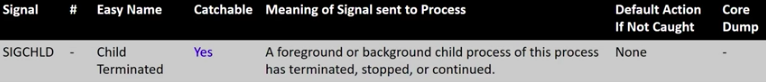
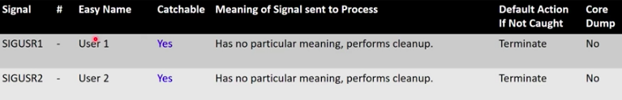

# Lecture 3.3 - Signals

[**Youtube**](https://www.youtube.com/watch?v=VwS3dx3uyiQ)


## Inter-Process Communication (IPC)
* How can we connect our processes together? How can they communicate? Are there simple ways to do it?
* When a user process wants to contact the kernel, it uses a system call
* There are certain events that occur for which the kernel needs to notify a user process directly
* But how does the kernel or another process initiate contact with a user process?

## Signals
* Signals are the answer: they interrupt the flow of control (the order that individual instructions are executed) by stopping execution and jumping to an explicitly specified or default signal handler
* Critical point: signals tell a process to DO something - to take an action because of a user command or an event
* There are a fixed set of signals:
	* You cannot create your own signals, though the programmatic *response to* and *meaning of* most signals is up to you
	* There are two signals with no inherent meaning at all - you assign meaning to them by catching them and running code

## Uses for signals: Kernel to Process
* Notificatinos from the Kernel
	* A process has done something wrong
	* A timer has expired 
	* A child process has completed executing
	* An event associated with the terminal has occured
	* The process on the other end of a communication link has gone away

## Uses for signals: Process to process
* User process to user process notifications, perhaps to:
	* Suspend or resume execution of process
	* Terminate
	* Change modes
	* Change communication methods


## Signal Dictionary - Termination


## kill
* `kill -TERM 1234`
* The given PID affects who the signal is sent to:
	* If PID > 0, then the signal will be sent to the process PID given
	* If pid == 0, then the signal is sent to all processes in the same process group as the sender (from an interactive command line, this means the foreground process group, i.e. your shell)
	* More trickiness for pid < 0
* Let's test it out!

## Signaling a Script
```console
$ cat sigtermtest
#!/bin/bash
trap "echo 'SIGTERM Received! Exiting with 0!'; exit 0" SIGTERM
while [ 1 -eq 1]
do
	echo "nothing" > /dev/null
done
$ sigtermtest &
[1] 1708
$ psme
PPID 	PID 	EUSER 	 STAT	%CPU 	RSS		COMMAND
45333	751		root	 Ss 	0.0		4284	sshd: brewsteb [priv]
751		767		brewsteb S		0.0		2116	sshd: brewsteb@pts/9
767		768		brewsteb Ss+	0.0		2176	-bash
4533	1508	root	 Ss 	0.0		4284	sshd: brewsteb [priv]
1508	1510	brewsteb S 		0.0		2112	sshd: brewsteb@pts/12
1510	1511	brewsteb Ss 	0.0		2064	-bash
1511	1708	brewsteb R 		97.5	1220	/bin/bash ./sigtermtest
1511	1731 	brewsteb R+		0.0		1716	ps -eH -o ppid,pid,euser,stat,%cpu,rss,args
1511	1732	brewsteb S+		0.0		816		grep brewsteb
$ kill -SIGTERM 1708
SIGTERM Received! Exiting with 0!
[1]+	Done 	sigtermtest 
```

## Signal Dictionary - Notification of Wrongdoing


## Why Notify on Events? Branhing Logic!
* Gives the process a chance to clean up and finish any important tasks:
	* Perform final file writes
	* free() data
	* Write to log files
	* Send signals itself
* A process catching a signal and handling it will do all, some, or none of the above, and then either terminate itself or continue executing!

## Signal Dictionary - Control


## Timers!
* If you want to wait a specified period of time...
	* You can do a busy wait which will consume the CPU continuously while accomplishing nothing
	* Or you can tell the kernel that you want to be notified after a certain amount of time passes
* To set a time in UNIX
	* Call the alarm() or ualarm() functions
	* After the time you specify has passed, the kernel will send your process a SIGALRM signal 

* This is how sleep() works:
	* sleep() calls alarm()
	* sleep() then calls pause(), which puts process into waiting state
	* when SIGALARM is received, sleep() finally returns

## Signal Dictionary: Child Process Has Terminated

* Normally, wait() and waitpid() will suspend a process until one of its child processes has terminated
* Using the signal SIGCHILD allows a parent process to do other work instead of going to sleep and be notified via signal when a child terminates
* Then, when SIGCHLD is received, the process can (immediately or later) call wait() or waitpid() when ready, perhaps leaving the child a zombie for just a little while

## Signal Dictoinary: User-Defined Signals

* SIGUSR1 & SIGUSR2 has no special meaning to the kernel
* THe author of both the sending and receiving processes must agree on the interpretation of the meaning og SIGUSR1 and SIGUSR2

## SIGUSR1 Put Through its Paces
```console
$ cat sigchild
#!/bin/bash
set -m
trap "echo 'Triggering a child process termination with a silent ls'; ls > /dev/null" USR1
trap "echo 'SIGCHLD Received Exiting!'; exit 0" CHLD
whilel [ 1 -eq 1]
do
	echo "nothing" > /dev/null
done
$ sigchildtest &
[1] 19141
$ psme
PPID 	PID 	EUSER 	 STAT 	%CPU 	RSS 	COMMAND
4533	18174	root 	 Ss 	0.0		4280	sshd: brewsteb [priv]
18174	18187	brewsteb S 		0.0		2108	sshd: brewsteb@pts/9	
18187	18188	brewsteb Ss 	0.0		2104	-bash
18188	19141	brewsteb R 		102		1224	/bin/bash ./sigchltest
18188	19159	brewsteb R+ 	0.0		1844 	ps -eH -o ppid,pid,euser,stat,%cpu,rss,args
18188	19160	brewsteb S+		0.0		816		grep brewsteb
$ kill -SIGUSR1 19141
Triggering a child process termination with a silent ls
SIGCHLD Received Exiting!
[1]+ DONE 	sigchldtest
$ psme
PPID 	PID 	EUSER 	 STAT 	%CPU 	RSS 	COMMAND
4533	18174	root 	 Ss 	0.0		4280	sshd: brewsteb [priv]
18174	18187	brewsteb S 		0.0		2108	sshd: brewsteb@pts/9	
18187	18188	brewsteb Ss 	0.0		2104	-bash
18188	19159	brewsteb R+ 	0.0		1844 	ps -eH -o ppid,pid,euser,stat,%cpu,rss,args
18188	19160	brewsteb S+		0.0		816		grep brewsteb
```

## Abnormal Termination: Core Dumps
* Some signals received cause an "abnormal termination"
* This also occurs during runtime if the process crashes due to a segmentation fault, bus error, etc.
* When this happens, a memory core dump is created which contains:
	* Contents of all variables, hardware registers, & kernel process info at the time the termination occured
* This core fille can be used after the fact to identify what went wrong
* Depending on configuration, core dump files can be difficult to locate on your machine

## "Core" Etymology
> Magnetic-core memory was the predominant form of random-access computer memory for 20 years between about 1955 and 1975. Such memory is often just called core memory, or, informally, core.
> Core uses tiny magnetic toroids (rings), the cores, through which wires are threaded to write and read information. Three wires pass through each core.
> Each core stores one bit of information. A core's magnetization can be clockwise or counter-clockwise. The value of the bit stored in a core is zero or one according to the direction of that core's magnetization. The wires allow for the direction of the magnetization in the cores to be set, one core at a time, so that it stores either a one or a zero.
> The magnetizations of the cores are changed by sending pulses of electric current through selected wires. The process of reading the core causes the core to be reset to a zero, thus erasing it. This is called destructive readout. When not being read or written, the cores maintain the last value they had, even if the power is turned off. Therefore they are a type of non-volatile memory."


