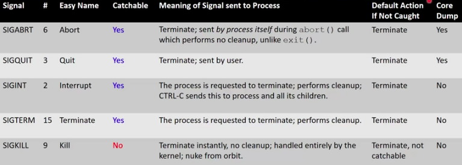
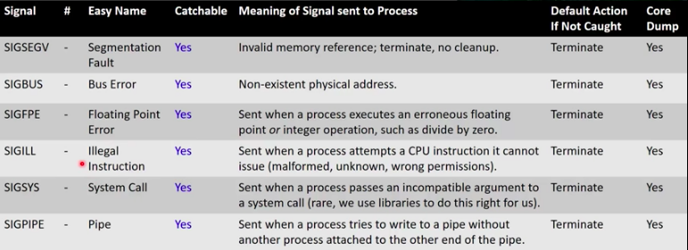
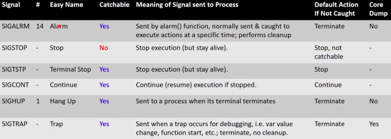

# Lecture 3.3 - Signals

[**Youtube**](https://www.youtube.com/watch?v=VwS3dx3uyiQ)


## Inter-Process Communication (IPC)
* How can we connect our processes together? How can they communicate? Are there simple ways to do it?
* When a user process wants to contact the kernel, it uses a system call
* There are certain events that occur for which the kernel needs to notify a user process directly
* But how does the kernel or another process initiate contact with a user process?

## Signals
* Signals are the answer: they interrupt the flow of control (the order that individual instructions are executed) by stopping execution and jumping to an explicitly specified or default signal handler
* Critical point: signals tell a process to DO something - to take an action because of a user command or an event
* There are a fixed set of signals:
	* You cannot create your own signals, though the programmatic *response to* and *meaning of* most signals is up to you
	* There are two signals with no inherent meaning at all - you assign meaning to them by catching them and running code

## Uses for signals: Kernel to Process
* Notificatinos from the Kernel
	* A process has done something wrong
	* A timer has expired 
	* A child process has completed executing
	* An event associated with the terminal has occured
	* The process on the other end of a communication link has gone away

## Uses for signals: Process to process
* User process to user process notifications, perhaps to:
	* Suspend or resume execution of process
	* Terminate
	* Change modes
	* Change communication methods


## Signal Dictionary - Termination


## kill
* `kill -TERM 1234`
* The given PID affects who the signal is sent to:
	* If PID > 0, then the signal will be sent to the process PID given
	* If pid == 0, then the signal is sent to all processes in the same process group as the sender (from an interactive command line, this means the foreground process group, i.e. your shell)
	* More trickiness for pid < 0
* Let's test it out!

## Signaling a Script
```console
$ cat sigtermtest
#!/bin/bash
trap "echo 'SIGTERM Received! Exiting with 0!'; exit 0" SIGTERM
while [ 1 -eq 1]
do
	echo "nothing" > /dev/null
done
$ sigtermtest &
[1] 1708
$ psme
PPID 	PID 	EUSER 	 STAT	%CPU 	RSS		COMMAND
45333	751		root	 Ss 	0.0		4284	sshd: brewsteb [priv]
751		767		brewsteb S		0.0		2116	sshd: brewsteb@pts/9
767		768		brewsteb Ss+	0.0		2176	-bash
4533	1508	root	 Ss 	0.0		4284	sshd: brewsteb [priv]
1508	1510	brewsteb S 		0.0		2112	sshd: brewsteb@pts/12
1510	1511	brewsteb Ss 	0.0		2064	-bash
1511	1708	brewsteb R 		97.5	1220	/bin/bash ./sigtermtest
1511	1731 	brewsteb R+		0.0		1716	ps -eH -o ppid,pid,euser,stat,%cpu,rss,args
1511	1732	brewsteb S+		0.0		816		grep brewsteb
$ kill -SIGTERM 1708
SIGTERM Received! Exiting with 0!
[1]+	Done 	sigtermtest 
```

## Signal Dictionary - Notification of Wrongdoing


## Why Notify on Events? Branhing Logic!
* Gives the process a chance to clean up and finish any important tasks:
	* Perform final file writes
	* free() data
	* Write to log files
	* Send signals itself
* A process catching a signal and handling it will do all, some, or none of the above, and then either terminate itself or continue executing!

## Signal Dictionary - Control


## Timers!
* If you want to wait a specified period of time...
	* You can do a busy wait which will consume the CPU continuously while accomplishing nothing
	* Or you can tell the kernel that you want to be notified after a certain amount of time passes
* To set a time in UNIX
	* Call the alarm() or ualarm() functions
	* After the time you specify has passed, the kernel will send your process a SIGALRM signal 

* This is how sleep() works:
	* sleep() calls alarm()
	* sleep() then calls pause(), which puts process into waiting state
	* when SIGALARM is received, sleep() finally returns


